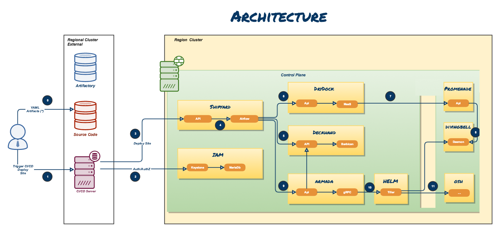

Airship Operator
================

Airship is a collection of components that coordinate to form means of
configuring and deploying and maintaining
a `Kubernetes <https://kubernetes.io/>`__ environment using a
declarative set of `yaml <http://yaml.org/>`__ documents.

On the other side, the CRD Operator patterns is beeing adopted by the 
Kubernetes Commnunity. A human Operator is basically asked to create
a new Custom Resource (for instance an ETCD cluster) in the Kubernetes 
and a Controller is in charge of creating reconciling the actual present
in Kubernetes.

Airship Project
==================

.. toctree::
   :maxdepth: 2

   airship

CRD Overview
==================

.. toctree::
   :maxdepth: 2

   operator

CRD Detailled Design
====================

.. toctree::
   :maxdepth: 2

   armadachart
   armadachartgroup
   armadamanifest
   usage

Help Needed
====================

.. toctree::
   :maxdepth: 2

   todo

Uselful Links
=============

.. _Airship: https://www.airshipit.org/
.. _Helm Homepage: https://helm.sh/
.. _Kubernetes Homepage: https://kubernetes.io/
.. _yaml: http://yaml.org/
