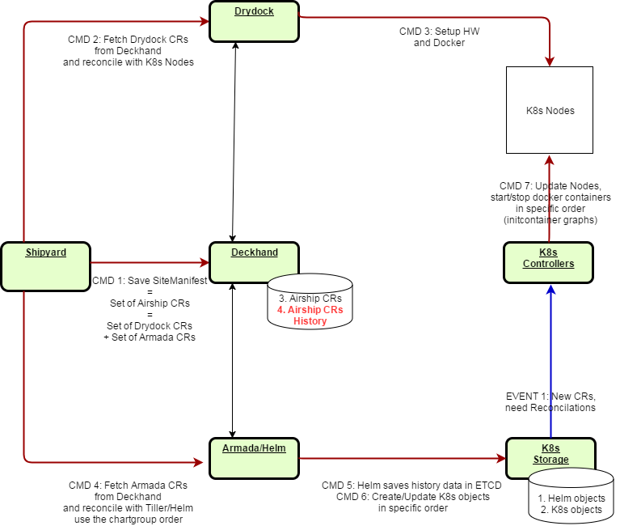
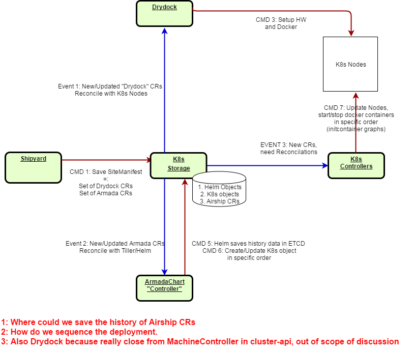
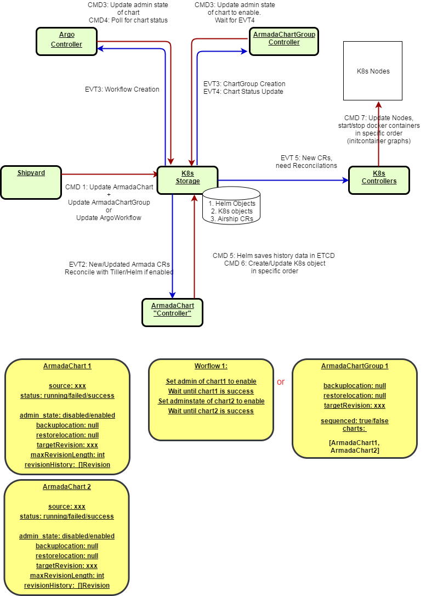
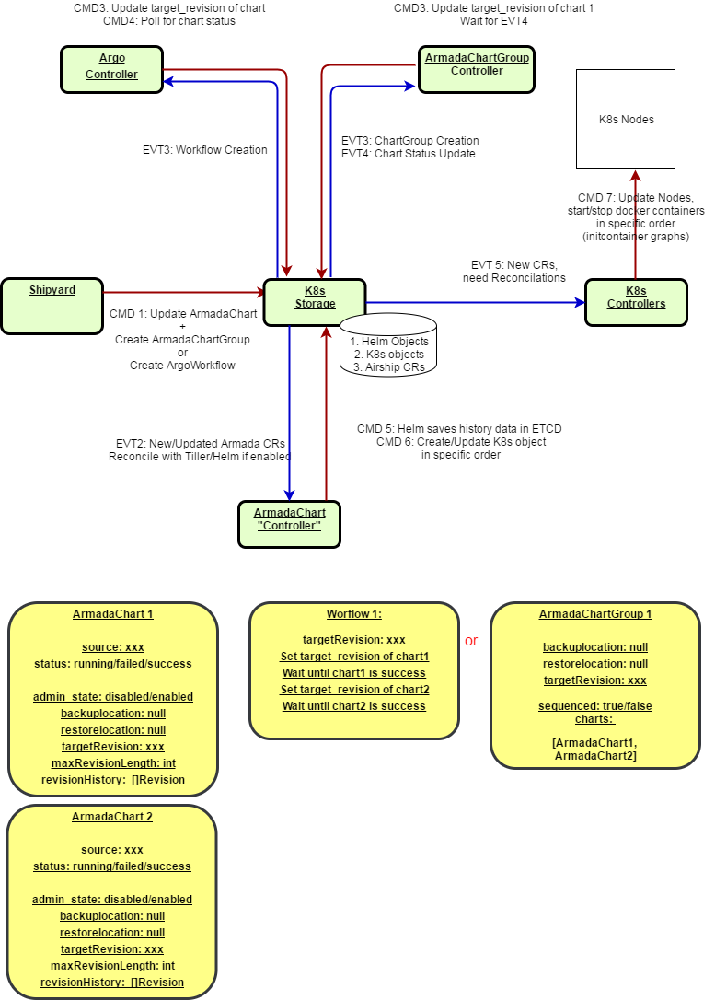
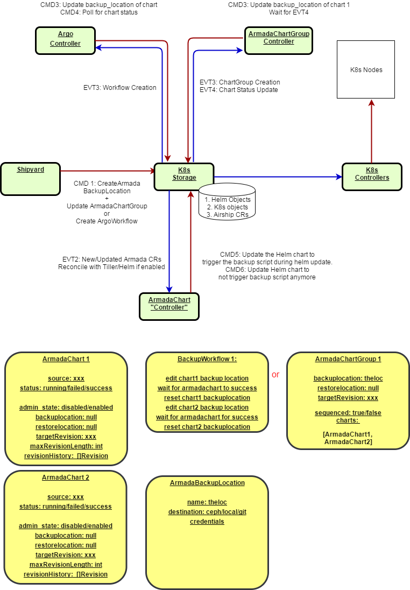
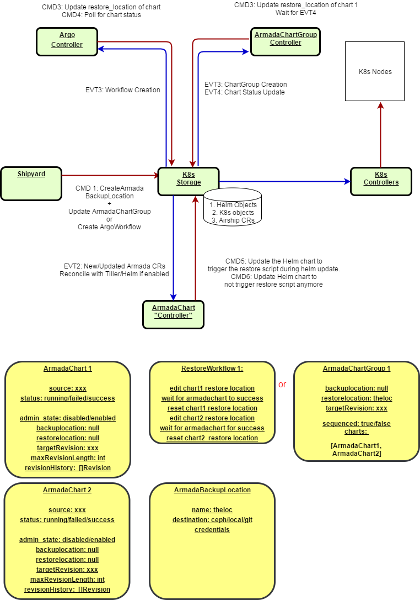

CRD Overview
===================

`Kubernetes Extension <https://kubernetes.io/docs/concepts/extend-kubernetes/api-extension/custom-resources/>`_

CRD and Airship
==================

CRD in Deckhand
----------------

In the Airship used for production deployment, the SiteManifest could be viewed as a composition of Custom Resources:

- "Drydock" CR describing the kubernetes nodes, network, kublet.
- "ArmadaChart" CR describing the location of the helm chart and the helm chart value override.

Shipyard, Drydock and Armada are orchestrating the order of deployment:

1. BareMetal OS, Network
2. Docker, Kubelet, Kubernetes
3. Storage, CEPH
4. Applications for instance MariaDB

In the subsequent drawings, `red arrows` represent APIs and CLI calls (arship or kubernetes calls),
`blue arrows` represents `events` generated by K8s.

CRD in ETCD
----------------

This view here describe how ETCD could potentially fullfill the role of Deckhand assuming that:

- "History" of the CRDs is ensured. A rollback to a previous version should be possible.
- "Sequencement" of the deployment is ensured. Helm Chart for CEPH needs to run before Helm Chart for MariaDB

CRD Process Flows
=================

Deployment Flow
----------------

The main principal is:

1. Create all the charts in ETCD and "disable" the reconcile feature
2. Changing the admin_state to enable triggers the Reconciliation/Installation of the HelmChart
3. Either a ChartGroup or an Argo workflow enables the ArmadaCharts in the proper order.

Upgrade/Rollback Flow
---------------------

1. Changing the targetVersion in the ArmadaChart triggers the Upgrade/Rollback of the HelmChart
2. Either a ChartGroup or an Argo workflow update the targetVersion attribute of the ArmadaCharts in the proper order.
3. the "targetVersion" attribute usage will potentially completly remove the need for the enabled/disabled state. Moving the "targetVersion" from 0 to 1 would indeed have the same effect than changing the admin state from disabled to enabled.

Backup Flow
----------------

1. Create an ArmadaBackupLocation CRD
2. Pointing the backupLocation in the ArmadaChart to the previous CRD triggers the backup of the stateful data associated with the HelmChart
3. Either a ChartGroup or an Argo workflow update the backupLocation attribute of the ArmadaCharts in the proper order.

Restore Flow
----------------

1. Create an ArmadaBackupLocation CRD
2. Pointing the restoreLocation in the ArmadaChart to the previous CRD triggers the restore of the stateful data associated with the HelmChart
3. Either a ChartGroup or an Argo workflow update the restoreLocation attribute of the ArmadaCharts in the proper order.

.. toctree::
   :maxdepth: 2
