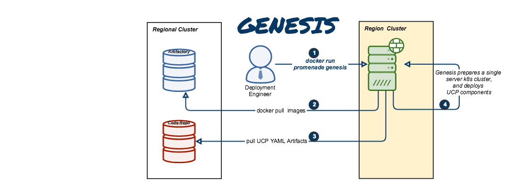
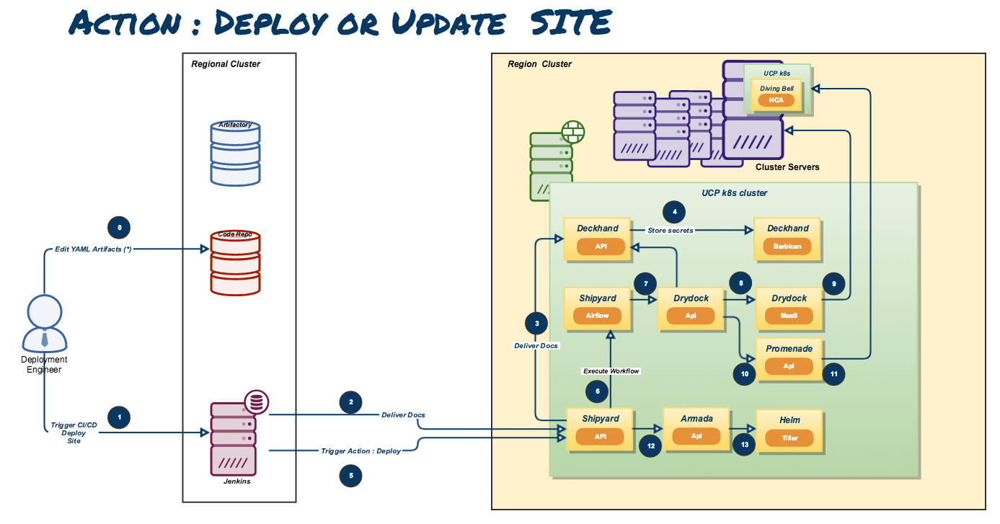

Airship evolution to CRD
========================

Airship is a collection of components that coordinate to form means of
configuring and deploying and maintaining
a `Kubernetes <https://kubernetes.io/>`__ environment using a
declarative set of `yaml <http://yaml.org/>`__ documents.

Airship Project
==================

.. image:: diagrams/architecture.png

Process Flows
-------------

CRD Overview
==================

Process Flows
=============

.. toctree::
   :maxdepth: 2

   airship

.. _Airship: https://www.airshipit.org/
.. _Helm Homepage: https://helm.sh/
.. _Kubernetes Homepage: https://kubernetes.io/
.. _yaml: http://yaml.org/

