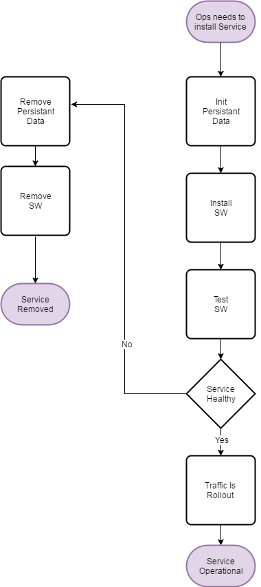

Greenfield Deployment
===========================

Schema
----------------------

Rationale
---------

1. Ops Team need to deploy a new service.
2. If the service is unhealty, it gets removed.
3. If the service is healty, it reaches the operational.

Brownfield Change
==================

Schema
------

Rationale
---------

1. Ops Team need to:

    - Use Case 1: remove a service.
    - Use Case 2: update a service.
    - Use Case 3: rollback a service.
2. Once the traffic is drain:

    - Use Case 1: the service is removed.
    - Use Case 2: the service is updated.
    - Use Case 3: the service is rollback.
3. Once the update/rollback is performed, the traffic is rollout.

Notes
-----
1. In order to perform a rollback or an update, the tools needs to have access to credentials.
   This means that the rollback and update pods need to be deployed with the rest of the helmchart
   in order to be able to have config and secrets recreated.
   and access the environment variables. We need to be able to be able to selectivly render the files which are
   matching the phase.
2. Drain the traffic from a service, especially if we need to do blue/green upgrade means changing the nginx setup.
3. How to do rolling upgrade when data is actually persisted in a database. Changing the database schema would mean:

    - Stopping the MariaDB replication on one of the node.
    - Ensure that "upgrade schema" script happens against that one pod.
    - Getting the pod running the new software to access that new pod. 
    - Ref Doc: https://www.weave.works/blog/how-to-correctly-handle-db-schemas-during-kubernetes-rollouts
    - Test the functionality of the service with the new schema
    - Rollout the rest of the traffic.

4. Above flow may be too complicated.

    - Preventing access to the other services could be enough ?
    - Requirement on backward compatibility of the schema.
    - How does Openstack service itself to do a rolling upgrade.
    - Is comple

