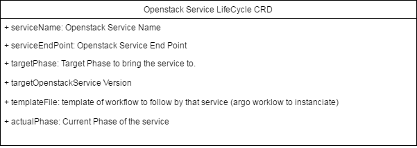

LifeCycle Modelisation
======================

Design
--------------------

Oslc CRD
--------------------

The CRD Oslc definition is available here:

1. Its Spec which is update through kubectl: `Spec <https://github.com/kubekit99/operator-ohm/blob/master/openstacklcm-operator/pkg/apis/openstacklcm/v1alpha1/oslc_types.go#L27>`_
2. Its Status which is updated by the operator and accessible through kubectl describe: `Status <https://github.com/kubekit99/operator-ohm/blob/master/openstacklcm-operator/pkg/apis/openstacklcm/v1alpha1/common_types.go#L161>`_
3. Its definition made out of the two above components: `Definition <https://github.com/kubekit99/operator-ohm/blob/master/openstacklcm-operator/pkg/apis/openstacklcm/v1alpha1/oslc_types.go#L109>`_
4. The yaml version of the CRD: `Yaml <https://github.com/kubekit99/operator-ohm/blob/master/openstacklcm-operator/chart/templates/openstacklcm_v1alpha1_oslc.yaml>`_

Oslc Controller
---------------------------

TBD

SubResources
---------------------------

The current PhaseCRD are currently standalone CRDs. This provides control to the phase-controller on those objects.
At one point we will have to weight if we need to keep those CRDs or simply consider the Phase as nodes of an Argo Workflow. 

.. toctree::
   :maxdepth: 2
