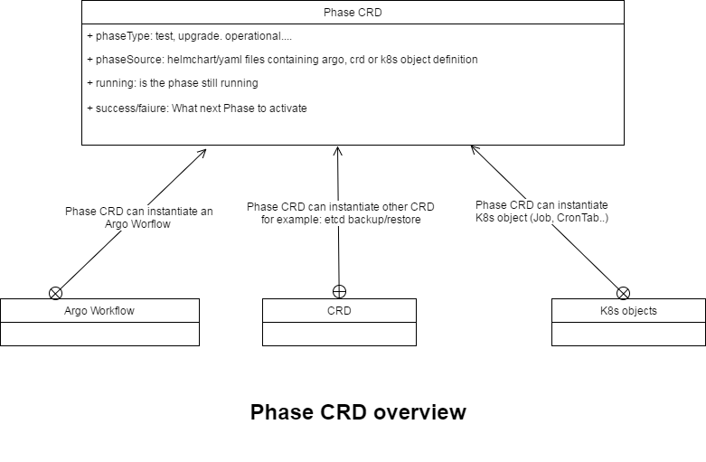

Phase Modelisation
==================

Design
--------------------

Phase CRD
--------------------

The CRD Phase definition is available here:

1. Its Spec which is update through kubectl: `Spec <https://github.com/kubekit99/operator-ohm/blob/master/openstacklcm-operator/pkg/apis/openstacklcm/v1alpha1/osphases_types.go#L27>`_
2. Its Status which is updated by the operator and accessible through kubectl describe: `Status <https://github.com/kubekit99/operator-ohm/blob/master/openstacklcm-operator/pkg/apis/openstacklcm/v1alpha1/common_types.go#L161>`_
3. Its definition made out of the two above components: `Definition <https://github.com/kubekit99/operator-ohm/blob/master/openstacklcm-operator/pkg/apis/openstacklcm/v1alpha1/osphases_types.go#L109>`_
4. The yaml version of the CRD: `Yaml <https://github.com/kubekit99/operator-ohm/blob/master/openstacklcm-operator/chart/templates/openstacklcm_v1alpha1_osphases.yaml>`_

Phase Controller
---------------------------

The current POC created one CRD per phase. Most of the attributes of those CRDs are common. At one point we will have
to weight the pros and cons of having only one PhaseCRD or one TestPhaseCRD, TrafficRolloutCRD.

SubResources
---------------------------

The PhaseCRD is built using the following principles:

1. The current PhaseCRD are currently standalone CRDs. This provides control to the phase-controller on those objects.
At one point we will have to weight if we need to keep those CRDs or simply consider the Phase as nodes of an Argo Workflow. 

2. The PhaseCRD is currently loading a yaml file. This could be a helm chart. The PhaseCRD is then owner of the subresources described
in the yaml file.

  a. an argo Workflow
  b. another CRD such as an Helm3Release or an EtcdBackup
  c. a simple kubernetes job, pod (utility container, script...)

3. The key aspect here is to be able to monitor the end of those tasks as well as the success/failure.

4. The HelmV2 renderer is supported. HelmV3 POC support has been added

.. toctree::
   :maxdepth: 2